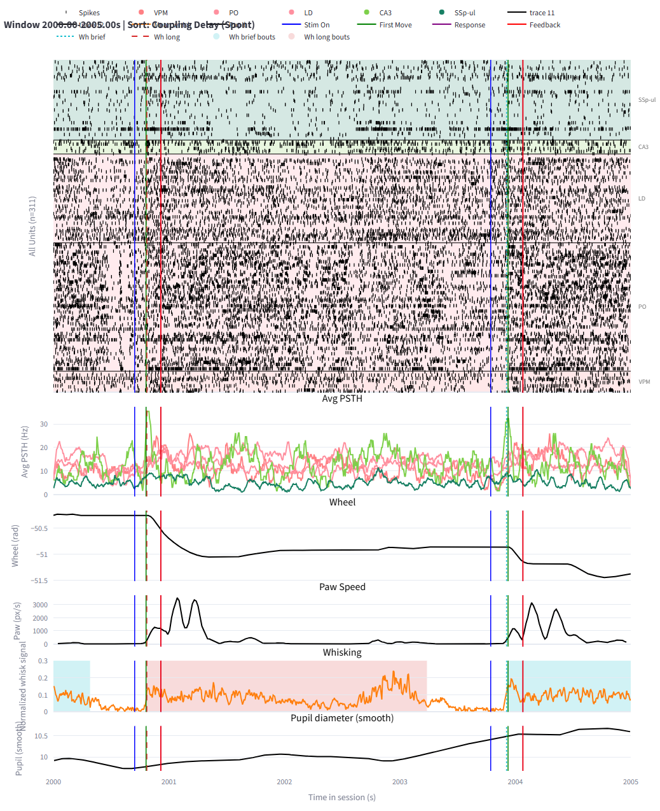
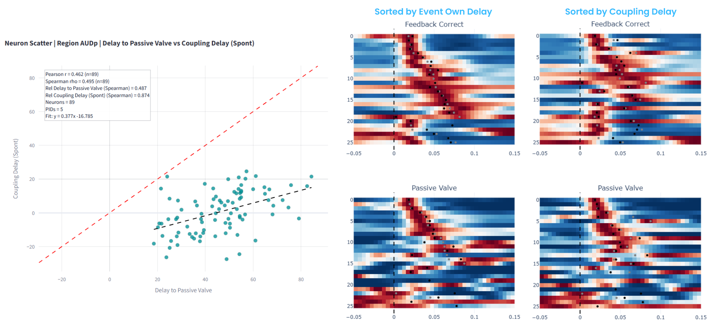
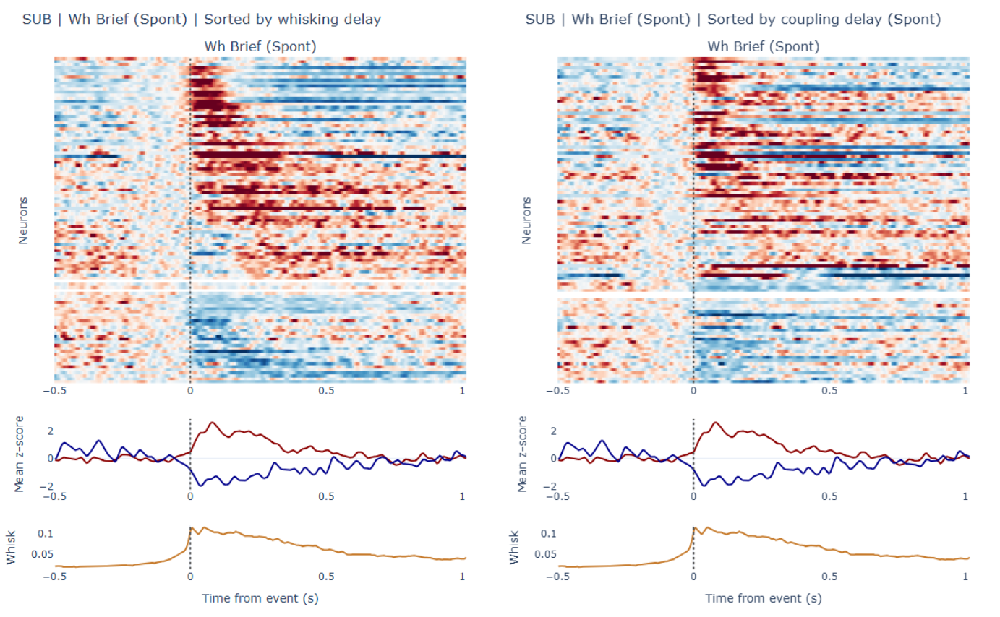

# SeqProject2026

This repository contains analysis code developed during my rotation project at CortexLab, UCL. It studies the functional role of brain-wide population sequences in IBL Neuropixels recordings using spike-triggered population rate (`stPR`) analyses and a cache-first workflow for fast interactive exploration.

The central question is whether a neuron's coupling to its population is related to behavior. In this project, that coupling is summarized by two per-neuron properties:

- `Coupling strength`: how strongly a neuron is locked to the surrounding population activity
- `Coupling delay`: when that neuron tends to fire relative to the population pattern

The repository then asks how those coupling properties relate to behaviorally relevant activity across the brain, especially around stimulus onset, first movement, feedback, and spontaneous whisking.



## Project Overview

The scientific motivation follows work showing that neurons have reliable coupling to the activity of the local population and that this coupling may reflect structured sequential dynamics rather than noise alone. Here, the same idea is pushed into a brain-wide behavioral setting using the IBL dataset.

The main analysis pipeline computes coupling properties from `stPR` curves, event-locked response magnitudes, and event-locked delays for many probe insertions (`PIDs`), then pools those results at the region level. This makes it possible to ask questions such as:

- Are coupling delay and event-response delay related within a region?
- Are coupling strength and event-response magnitude related within a region?
- Which regions show reliable positive or negative structure across animals and sessions?

The example below shows one representative case from auditory cortex (`AUDp`), where sorting neurons by event-response delay and by coupling delay produces a similar sequence-like ordering.



In addition to the main coupling analyses, the repository also includes passive auditory and visual analyses, whisking detection and whisking-aligned analyses, a dashboard for sequence-region comparisons, and preliminary work on packet detection / single-sequence extraction.

## What Is In This Repo

The scripts in this repository fall into three broad groups:

- `Single-PID analysis scripts`: detailed analyses and plotting for one probe insertion at a time
- `Batch / brain-wide scripts`: scripts that aggregate cached results across many PIDs or many regions
- `Dashboard scripts`: Streamlit-based interfaces for browsing cached results interactively

### Main dashboards

| Script | Purpose |
| --- | --- |
| [04_dashboard.py](scripts/04_dashboard.py) | Main single-PID dashboard for coupling, event responses, rasters, passive analyses, and neuron-level exploration |
| [07_dashboard_region_fast.py](scripts/07_dashboard_region_fast.py) | Fast brain-wide region dashboard built from precomputed pooled region summaries |
| [17_ibl_seq_regions_dash.py](scripts/17_ibl_seq_regions_dash.py) | Region dashboard for cached sequence-comparison outputs from the `15/16` pipeline |
| [20_packet_dashboard.py](scripts/20_packet_dashboard.py) | Interactive dashboard for the preliminary packet-detection pipeline |

### Utility modules

Most reusable functions live under `utils/`. Broadly:

- [analysis.py](utils/analysis.py): core analysis functions for coupling, delays, responses, PSTHs, and split-half metrics
- [io.py](utils/io.py): data loading, `ONE` access, atlas mapping, and session / cluster utilities
- [plotting.py](utils/plotting.py): Matplotlib-based plotting helpers
- [plotting_plotly.py](utils/plotting_plotly.py): Plotly-based plotting helpers used by the dashboards and browser figures
- [packet_dashboard.py](utils/packet_dashboard.py): helpers specific to the packet-analysis cache and dashboard

## Environment Setup

From the repository root:

```bash
conda env create -f environment.yml
conda activate Seq2026
```

If you use `mamba`, it is usually faster:

```bash
mamba env create -f environment.yml
```

## Data Requirements

This project is designed around IBL data accessed through `ONE`. For first-time runs, it is best to stay online so Alyx metadata and missing datasets can be fetched automatically.

All of the work in this repository was run on IBL data associated with:

- `TAG = "2025_Q3_IBL_et_al_BWM"`

and reflects analyses developed during the first three months of 2026.

After the first pass, the workflow becomes heavily cache-based. Many downstream scripts and dashboards reuse local files under `data/raw`, `data/dashboard_cache`, and `data/dashboard_region_cache` rather than recomputing from scratch.

## Recommended Workflows

### Main coupling and event-response workflow

Use this path for the core project analyses.

1. Configure processing scope in [03_calc_dashboard.py](scripts/03_calc_dashboard.py).
2. Run:

```bash
python scripts/03_calc_dashboard.py
```

This computes per-PID coupling metrics, response magnitudes, response delays, whisking-aligned metrics, passive-event metrics, and the cached tables used by the single-session dashboard.

3. Inspect single-PID results with:

```bash
streamlit run scripts/04_dashboard.py
```

4. Build pooled brain-wide region summaries with:

```bash
python scripts/08_batch_compute_region.py
```

5. Inspect the pooled region-level results with:

```bash
streamlit run scripts/07_dashboard_region_fast.py
```

This is the main pipeline of the project.

### Passive analyses

Use the passive analysis scripts when focusing on replay / passive sensory responses:

- [09_passive_auditory.py](scripts/09_passive_auditory.py) for passive auditory analyses
- [10_passive_visual.py](scripts/10_passive_visual.py) for passive visual analyses

### Whisking detection and whisking-aligned analysis

Use [11_ibl_whisk_seq.py](scripts/11_ibl_whisk_seq.py) for whisking-event detection and whisking-aligned exploration. In addition to event detection and response analysis, this script can export annotated whisking video clips from the left and right cameras.



### Packet detection workflow (preliminary)

This branch is exploratory and less mature than the main coupling pipeline:

- [18_packet_detection_template_matching.py](scripts/18_packet_detection_template_matching.py): single-PID packet analysis
- [19_packet_comp.py](scripts/19_packet_comp.py): batch packet calculations across PIDs
- [20_packet_dashboard.py](scripts/20_packet_dashboard.py): interactive packet dashboard
- [21_packet_heavy_plots.py](scripts/21_packet_heavy_plots.py): heavier packet plots that are not convenient to render inside the dashboard

## Cache and Output Structure

The repository is strongly cache-driven. The main folders are:

- `data/raw/`: local `ONE` / IBL cache and downloaded source data
- `data/processed/`: processed tables, exported summaries, auxiliary outputs, and derived artifacts such as some batch tables and video clips
- `data/dashboard_cache/`: per-PID cached bundles built by `03_calc_dashboard.py`; these are the main source for the single-session dashboard
- `data/dashboard_region_cache/`: pooled region-level summaries built by `08_batch_compute_region.py`; these are the source for `07_dashboard_region_fast.py`
- `data/packet_dashboard_cache/`: caches used by the packet-analysis workflow
- `data/processed/16_ibl_seq_batch_comp/`: cached batch sequence tables used by `17_ibl_seq_regions_dash.py`
- `results/`: saved figures and other exported analysis outputs

## Key Variables / Metrics

### Coupling properties

At the center of the project is the spike-triggered population rate (`stPR`):

```math
c_{i,\tau} = \frac{1}{\lVert f_i \rVert}\int f_i(t-\tau)\,
\frac{\sum_{j \ne i}\left(f_j(t)-\mu_j\right)}{\sum_{j \ne i}\mu_j}\,dt
```

where `f_i` is the activity of neuron `i`, the summed term is the leave-one-out population activity, and `\mu_j` is the mean activity of neuron `j`.

From this curve, the project uses two main per-neuron metrics:

- `Coupling strength`: the `stPR` value at lag `0`; neurons with stronger values are more "chorister-like", whereas weakly coupled neurons are more "soloist-like"
- `Coupling delay`: the signed center of mass of the `stPR` response around zero; negative values suggest earlier firing relative to the population ("leader-like"), positive values suggest later firing ("follower-like")

### Event-related variables

For four main event families, the project computes both a response magnitude and a response delay:

- `Stim On`
- `First Move`
- `Feedback`
- `Whisking`

Response magnitude is computed from a `5 ms` binned PSTH, z-scored relative to a pre-event baseline, then averaged within the event window. Delay is computed as a signed center of mass of the threshold-crossing response within the event window.

Default event windows are:

- `Stim On`: `[20, 350] ms`
- `First Move`: `[-100, 200] ms`
- `Feedback`: `[-100, 200] ms`
- `Whisking`: `[0, 400] ms`

For auditory regions, the project also includes separate correct-trial and incorrect-trial feedback response/delay variables.

### Reliability

Reliability in this repository means split-half consistency of the same variable:

- odd vs even trials / events where appropriate
- first half vs second half for spontaneous split metrics

At the region level, the main brain-wide plots compare:

- `correlation between two variables across neurons`
- against `the combined reliability of those variables`

This is why many plots are shown as "correlation vs reliability" rather than raw correlation alone.

## Configuration

The most important user-facing configuration lives in [03_calc_dashboard.py](scripts/03_calc_dashboard.py). In practice, the key choices are:

- which PIDs / subjects / regions to process
- whether to process the full tagged dataset or a restricted subset
- unit-quality thresholds
- event windows and response settings
- coupling settings and cache versioning

[08_batch_compute_region.py](scripts/08_batch_compute_region.py) controls the pooled region-level summary step. Most dashboard scripts are configuration-light because they read precomputed caches and expose plotting choices interactively instead.

When code affecting cached metrics changes, rerun the relevant upstream cache builder before trusting downstream dashboards.

## Project Layout

```text
SeqProject2026/
  scripts/
    03_calc_dashboard.py
    04_dashboard.py
    07_dashboard_region_fast.py
    08_batch_compute_region.py
    09_passive_auditory.py
    10_passive_visual.py
    11_ibl_whisk_seq.py
    13_ibl_GLM.py
    14_pid_table.py
    15_ibl_seq_comparison.py
    16_ibl_seq_batch_comp.py
    17_ibl_seq_regions_dash.py
    18_packet_detection_template_matching.py
    19_packet_comp.py
    20_packet_dashboard.py
    21_packet_heavy_plots.py
    24_single_neuron_raster.py
  utils/
    analysis.py
    io.py
    plotting.py
    plotting_plotly.py
    packet_dashboard.py
  web_dashboard/
    server.py
    static/
  data/
    raw/
    processed/
    dashboard_cache/
    dashboard_region_cache/
    packet_dashboard_cache/
  results/
  sample_dashboard_raster.png
  sample_whisking_sequence.png
```

## Current Status / Scope

- The main coupling, event-response, and pooled region-level analyses are the most mature and reliable parts of the repository.
- The whisking pipeline is usable and includes camera-based event inspection and dual-camera clip export.
- The packet-detection branch is still preliminary.
- The GLM notebook, [13_ibl_GLM.py](scripts/13_ibl_GLM.py), is exploratory and currently not a stable endpoint.
- The single-sequence / template-based modeling branch needs substantially more work before it should be treated as a finished method.

## AI-Assisted Development

Several large language models were used during development as coding assistants. In practice, Codex was the most useful one for this project, especially for refactoring, modularization, error handling, validation checks, code comments, and documentation work such as this README.

## Background Reading

- Luczak, A., McNaughton, B. L., & Harris, K. D. (2015). *Packet-based communication in the cortex*. *Nature Reviews Neuroscience, 16*, 745-755. https://www.nature.com/articles/nrn4026
  This is the best conceptual entry point for the broader idea behind the project. It frames temporally structured population activity as packet-like communication rather than unstructured background variability.

- Okun, M., Steinmetz, N. A., Cossell, L., Iacaruso, M. F., Ko, H., Bartho, P., Moore, T., Hofer, S. B., Mrsic-Flogel, T. D., Carandini, M., & Harris, K. D. (2015). *Diverse coupling of neurons to populations in sensory cortex*. *Nature, 521*, 511-515. https://www.nature.com/articles/nature14273
  This is the key source for coupling strength in the present repository. It motivates the chorister-versus-soloist interpretation and the idea that population coupling captures an important component of neural variability.

- International Brain Laboratory et al. (2025). *A brain-wide map of neural activity during complex behaviour*. *bioRxiv*. https://www.biorxiv.org/content/10.64898/2025.12.20.695676v2
  This is the most directly related large-scale reference for the project. It motivates the brain-wide framing, supports the idea of invariant sequential structure, and is the closest methodological ancestor of the coupling analyses implemented here.

## License

Released under the MIT License. See [LICENSE](LICENSE).
